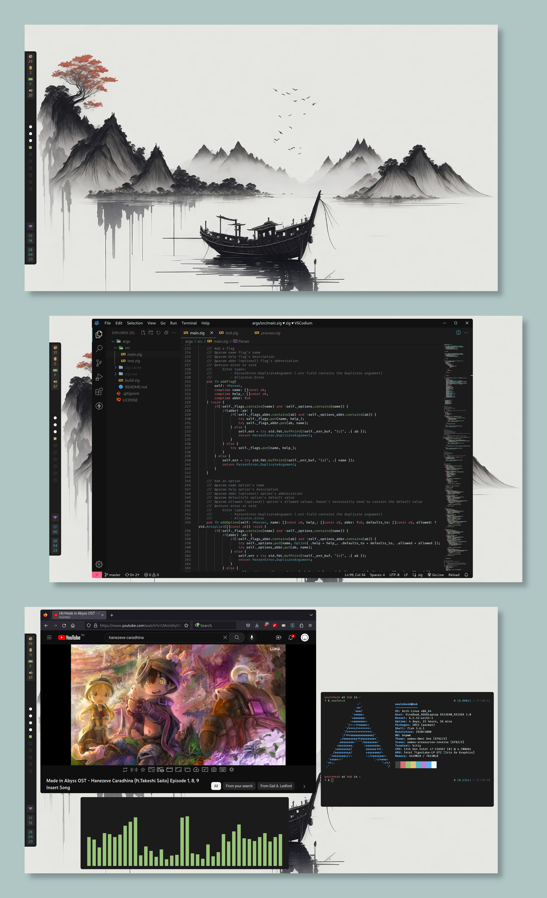
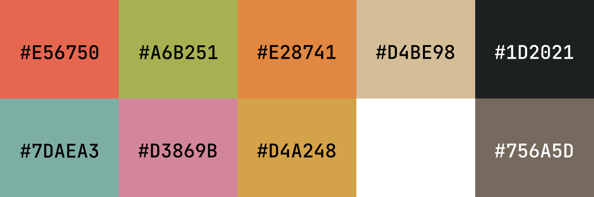

---

## Outdated screenshots

## :pencil2: Details

- **OS**: [Arch Linux](https://archlinux.org/)
- **WM**: [bspwm](https://github.com/baskerville/bspwm)
- **Terminal**: [Kitty](https://sw.kovidgoyal.net/kitty/)
- **Shell**: [Fish](https://fishshell.com/)
- **Compositor**: [Picom](https://github.com/jonaburg/picom)
- **Bar**: [Polybar](https://polybar.github.io/)
- **App launcher**: [Rofi](https://github.com/davatorium/rofi)
- **Notification daemon**: [Dunst](https://github.com/dunst-project/dunst)
- **Colorscheme**: Omni One
- **Browser**: [Firefox](https://www.mozilla.org/en-US/firefox/new/)
- **Text Editor**: [VSCodium](https://vscodium.com/)
- **Fonts**:
  - [FiraCode Nerd](https://www.nerdfonts.com/font-downloads)
  - [Comfortaa](https://fonts.google.com/specimen/Comfortaa)

## :art: Colorscheme

## :clipboard: Notes

Rofi config by [adi1090x](https://github.com/adi1090x/rofi)

The GTK theme was generated with [oomox](https://github.com/themix-project/oomox)
