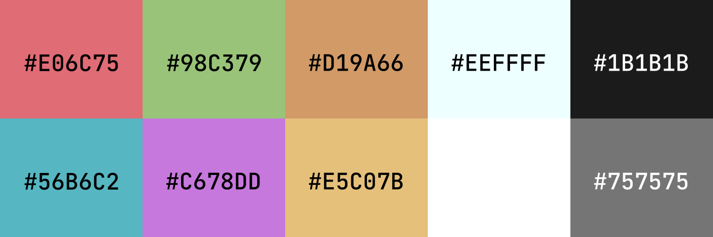

---

## :pencil2: Details

- **OS**: [Arch Linux](https://archlinux.org/)
- **WM**: [bspwm](https://github.com/baskerville/bspwm)
- **Terminal**: [Alacritty](https://alacritty.org/)
- **Shell**: [Fish](https://fishshell.com/)
- **Compositor**: [Picom](https://github.com/jonaburg/picom)
- **Bar**: [Polybar](https://polybar.github.io/)
- **App launcher**: [Rofi](https://github.com/davatorium/rofi)
- **Notification daemon**: [Dunst](https://github.com/dunst-project/dunst)
- **Colorscheme**: Nightfall
- **Browser**: [Brave](https://brave.com/)
- **Text Editor**: [Neovim](https://neovim.io/)
- **Fonts**:
  - [Cozette](https://github.com/slavfox/Cozette)
  - [Comfortaa](https://fonts.google.com/specimen/Comfortaa)
  - [JetBrainsMono Nerd](https://www.nerdfonts.com/font-downloads)

## :art: Colorscheme

## :clipboard: Notes

Rofi config by [adi1090x](https://github.com/adi1090x/rofi)

Nightfall is a recreation of [HeavyRain266's colorscheme](https://www.reddit.com/r/unixporn/comments/n9alr9/awesome_working_on_rosequartz_compositor_birthday/) with the same name. You can find a vim plugin for it [here](https://github.com/Aoutnheub/nightfall.vim).

The GTK theme was generated with [oomox](https://github.com/themix-project/oomox)
