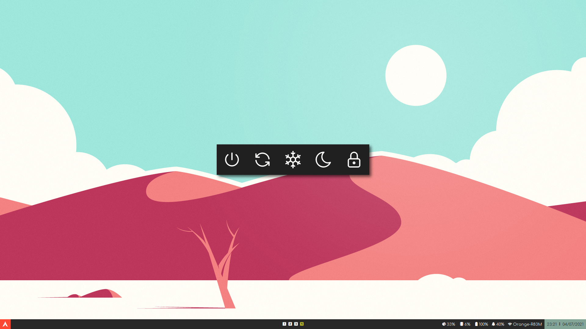

# Details
- **OS**: ArcoLinux
- **WM**: i3
- **Terminal**: Kitty
- **Shell**: Fish
- **Compositor**: Picom
- **Bar**: Polybar
- **Colorscheme**: Everforest
- **Browser**: Brave
- **Text Editor**: Neovim

# Screenshots

